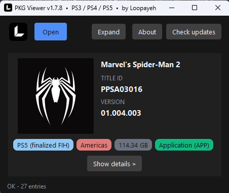

# PKG Viewer — PS3 / PS4 / PS5




**PKG Viewer** shows what's inside a PlayStation game file without extracting it: cover art, title, Title ID, region, version, and required firmware. Retail (original) PKGs fully supported — including split multi-part sets.

Works with `.pkg` packages, `.exfat` / `.ffpfsc` / `.ffpkg` images, and game folders.

## Download

Get `PKGViewer-Setup-X.Y.Z.exe` from [Releases](../../releases) — no Python needed, no admin needed.

## Why the installer


Grab `PKGViewer-Setup-X.Y.Z.exe` from [Releases](../../releases) — no admin needed:
- every format gets its own icon (`.pkg` / `.exfat` / `.ffpfsc` / `.ffpkg`) and opens on double-click — no Open With setup
- shows up in `Settings → Default apps`, so all four formats go Always in one place
- updates itself in place, no reinstall hassle
- uninstall wipes everything clean (files, icons, registry)

## Features

- Cover art preview (icon0.png, pic0.png, …) with Save / Copy to clipboard — online Store cover for encrypted retail PKGs
- Spec card: Title ID, Content ID, version, region, Min. System, SDK, DRM
- Latest patch version per game (PS5/PS4) with PKG-vs-latest compare
- Files tab: named entries with id + size
- Details tab: curated param.sfo / param.json, Show all for the full dump
- Drag & drop: PKG files, exFAT / ffpfsc / ffpkg images, and game folders onto the window
- AMPR / LZ4 asset containers (LIZARD dumps): listed with size in the spec card + Files tab
- Copy/paste works in every text field, on any keyboard layout
- Self-updating: silent check at startup, header button lights up on new release
- CLI mode: `pkgviewer.py --info file.pkg`

## Usage

Drag & drop a `.pkg` / `.exfat` / `.ffpfsc` / `.ffpkg` file or a game folder onto the exe or the open window, or use Open. To run from source (needs Python 3 + Pillow + tkinterdnd2 + mkpfs + pytsk3 + cryptography):

```bat
PKGViewer.bat
```

## Supported formats

- **PS3 packages** (`.pkg`) — retail + debug NPDRM, decrypted listing
- **PS3 game folders** — NPDRM and PS3_GAME layouts
- **PS4 / PS5 packages** (`.pkg`) — game, DLC, update, retail + split parts
- **PS5 disk images** (`.exfat`) — game dumps
- **PS5 compressed images** (`.ffpfsc`) — game dumps
- **PS5 UFS2 images** (`.ffpkg`) — game dumps (needs pytsk3 from source)
- **PS5 app folders** — extracted game folder (incl. LIZARD AMPR/LZ4 dumps)

## Build from source

```bat
pip install pyinstaller pillow
python -m PyInstaller --noconfirm --clean --onefile --windowed --name PKGViewer --collect-submodules PIL pkgviewer.py
```

## License

MIT — see [LICENSE](LICENSE).

## Contact

Telegram: [@loopayeh](https://t.me/loopayeh)
