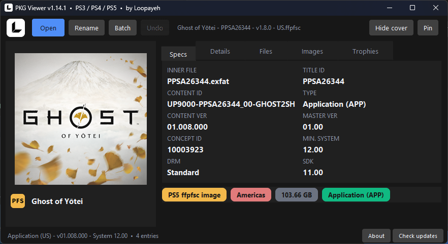
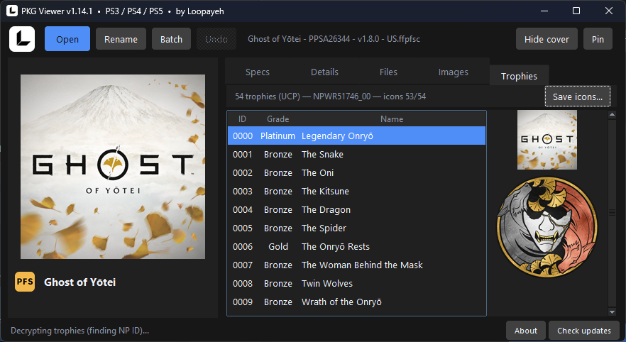
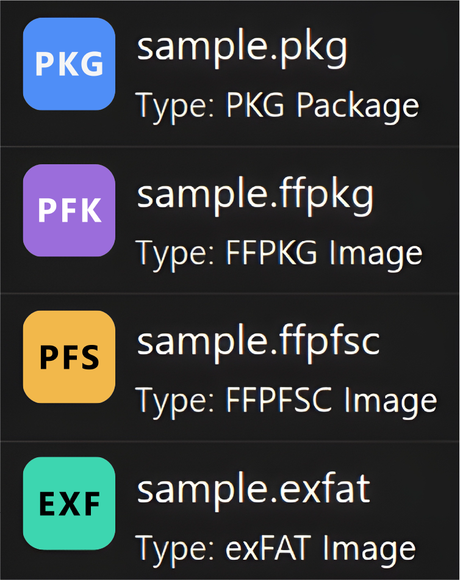

# PKG Viewer — PS3 / PS4 / PS5




**PKG Viewer** shows what's inside a PlayStation game file without extracting it: cover art, title, Title ID, region, version, and required firmware. Retail (original) PKGs fully supported — including split multi-part sets.

Works with `.pkg` packages, `.exfat` / `.ffpfsc` / `.ffpkg` images, and game folders.

## Download

Get `PKGViewer-Setup-X.Y.Z.exe` from [Releases](../../releases) — no Python needed, no admin needed.

## Why the installer



Grab `PKGViewer-Setup-X.Y.Z.exe` from [Releases](../../releases) — no admin needed:
- every format gets its own icon (`.pkg` / `.exfat` / `.ffpfsc` / `.ffpkg`) and opens on double-click — no Open With setup
- shows up in `Settings → Default apps`, so all four formats go Always in one place
- updates itself in place, no reinstall hassle
- uninstall wipes everything clean (files, icons, registry)

## Features

- Cover art preview (icon0.png, pic0.png, …) with Save / Copy to clipboard — online Store cover for encrypted retail PKGs
- Spec card: Title ID, Content ID, version, region, Min. System, SDK, DRM
- Latest patch version per game (PS5/PS4) with PKG-vs-latest compare
- Files tab: named entries with id + size — single-file Extract with rename, trophy00.trp contents
- Trophies tab: decrypted trophy list (name, grade, hidden) with icons, banner art, Save icons export
- OFC (Official) / FPKG (Fake) detection + badges for PS4 and PS5 (incl. split parts)
- Details tab: curated param.sfo / param.json, Show all for the full dump
- Drag & drop: PKG files, exFAT / ffpfsc / ffpkg images, and game folders onto the window
- Rename: clean uniform names from PKG info (`Title - TID - vVersion - Region`, e.g. `Elden Ring - PPSA04863 - v1.06 - EU`) — single file via the Rename button (preview + header Undo), or many at once via the Batch button / dropping them all (batch dialog with preview + All/None + revert log); folders are scanned for game files; split multi-part sets stay together; Revert restores original names from any revert log
- AMPR / LZ4 asset containers (LIZARD dumps): listed with size in the spec card + Files tab
- Copy/paste works in every text field, on any keyboard layout
- Self-updating: silent check at startup, header button lights up on new release
- CLI mode: `pkgviewer.py --info file.pkg` — batch: `pkgviewer.py --batch-rename folder [--recursive] [--apply]` (dry run without `--apply`) — revert: `pkgviewer.py --revert batch_rename_*.log [--apply]`

## Usage

Drag & drop a `.pkg` / `.exfat` / `.ffpfsc` / `.ffpkg` file or a game folder onto the exe or the open window, or use Open. To run from source (needs Python 3 + Pillow + tkinterdnd2 + mkpfs + pytsk3 + cryptography):

```bat
PKGViewer.bat
```

## Supported formats

- **PS3 packages** (`.pkg`) — retail + debug NPDRM, decrypted listing
- **PS3 game folders** — NPDRM and PS3_GAME layouts
- **PS4 / PS5 packages** (`.pkg`) — game, DLC, update, retail + split parts
- **PS5 disk images** (`.exfat`) — game dumps
- **PS5 compressed images** (`.ffpfsc`) — game dumps
- **PS5 UFS2 images** (`.ffpkg`) — game dumps (needs pytsk3 from source)
- **PS5 app folders** — extracted game folder (incl. LIZARD AMPR/LZ4 dumps)

## Build from source

```bat
pip install pyinstaller pillow
python -m PyInstaller --noconfirm --clean --onefile --windowed --name PKGViewer --icon assets\logo.ico --add-data "assets;assets" --add-data "assets_about.png;." --collect-submodules PIL pkgviewer.py
```

## Support

If this tool was useful, you can support me with USDT (BEP-20 / BNB Smart Chain):

`0x839a30D52Ef7D2b53e818b9931efd7FE6F472e50`

[Pay via Trust Wallet](https://link.trustwallet.com/send?coin=20000714&address=0x839a30D52Ef7D2b53e818b9931efd7FE6F472e50&token_id=0x55d398326f99059fF775485246999027B3197955)

## License

MIT — see [LICENSE](LICENSE).

## Contact

Telegram: [@loopayeh](https://t.me/loopayeh)
